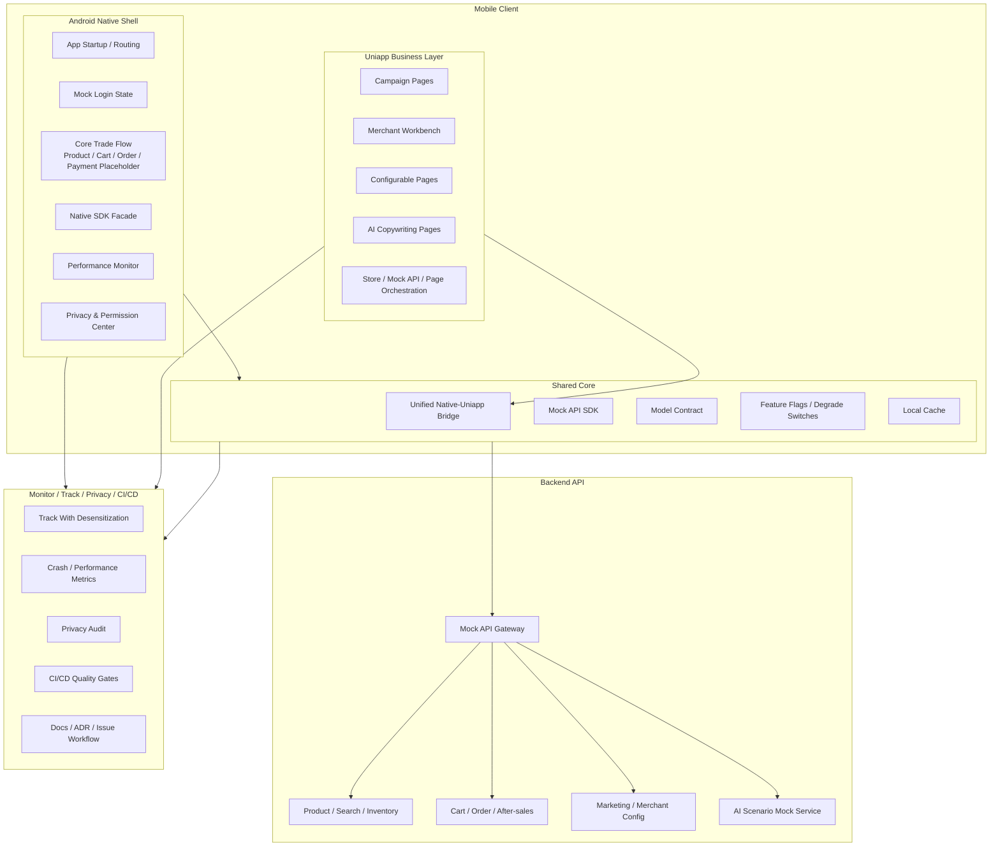

# Architecture Overview

## 目的

本文件是双端电商架构样板的主入口，服务于面试讲解和后续小 issue 开发。项目不是完整电商 App，不接真实后端，不做真实登录、支付或第三方 SDK 集成；它用清晰边界展示 Android Native、Uniapp、Bridge、隐私合规、性能治理、CI/CD 和 AI 辅助工程如何协作。

每次开发或文档任务开始前，应先阅读：

- `AGENTS.md`
- `docs/CONTEXT.md`
- `docs/architecture.md`
- 相关 `docs/adr/*.md`

## 整体架构图

## Android Native 负责什么

Android Native 承担稳定核心、系统能力、性能敏感能力和合规边界：

- 启动：负责 App 启动流程、首屏路由、基础配置加载和必要能力初始化。
- 登录态：只维护 mock 登录态或游客态，不实现真实登录；为核心链路提供统一身份状态。
- 支付：只保留支付架构占位和风险边界，不接真实支付 SDK；核心交易链路仍由 Native 管控。
- 推送：只做能力边界说明或 mock 入口，不接真实推送 SDK。
- 商品核心流：商品详情关键动作、价格状态、库存状态和核心购买入口由 Native 表达。
- 购物车：购物车核心状态、数量变更、防重复提交和结算入口由 Native 表达。
- 订单提交：订单确认、提交状态、幂等 token、异常兜底由 Native 表达。
- Native SDK：相机、定位、存储、通知、剪贴板等能力通过受控门面暴露，不允许 Uniapp 直接调用内部实现。
- 性能监控：启动耗时、页面加载、网络耗时、图片加载、Bridge 调用耗时和错误率统一采集。
- 隐私合规：权限申请、隐私弹窗、SDK 初始化时机、敏感 API 访问和埋点脱敏统一收口。

## Uniapp 负责什么

Uniapp 承担高频变化、运营配置、轻量管理和展示编排：

- 活动页：大促会场、专题活动、优惠集合等快速变化页面。
- 营销页：优惠券、满减、会员权益、裂变活动等展示和领取流程。
- 商家工作台：toB 首页、待处理事项、轻量数据看板和操作入口。
- 商品管理轻量页：商品标题、图片、上下架、基础信息编辑的 mock 页面。
- 订单筛选页：面向商家或运营的订单列表筛选、状态过滤和批量入口。
- AI 文案生成页：商品标题、卖点、营销文案生成和人工确认流程。
- 配置化页面：基于 mock 配置渲染的店铺装修、模块化楼层和活动模板。

Uniapp 只通过统一 Bridge 调用 Native 能力，只调用 mock API，不承载核心交易链路。

## 为什么这样拆

核心交易链路要求稳定、安全、性能强，所以 Native 化。商品关键动作、购物车、订单提交和支付占位都涉及交易一致性、风控、异常兜底和用户资产安全，放在 Native 能降低容器差异和动态页面发布带来的不确定性。

高频变化运营页面要求快速交付，所以 Uniapp 化。活动、营销、商家轻量工作台和 AI 文案页面变化频繁，适合通过 Uniapp 提高迭代速度，并降低 Native 发版压力。

通过 Bridge 统一 Native 能力。Bridge 是唯一边界，负责能力注册、参数校验、权限检查、错误码和回调协议，避免页面散落调用系统能力。

通过 API SDK 和 Model Contract 保证双端一致。Native 与 Uniapp 面向同一套 mock API 语义和模型契约，避免字段含义、状态枚举和错误处理在双端各自漂移。

## Android 模块边界

- `app`：App 壳、启动、路由入口和模块装配。
- `core`：日志、配置、网络 mock、缓存、基础工具和通用 UI 能力。
- `domain`：领域模型、用例接口和业务规则表达。
- `data`：Repository 实现、mock 数据源和 API DTO 映射。
- `feature`：商品、购物车、订单、商家等业务页面骨架。
- `bridge`：Native-Uniapp 通信协议、能力注册、调用分发、错误处理和安全控制。
- `privacy`：权限、隐私弹窗、合规状态、SDK 初始化边界和审计记录。

## Uniapp 分层边界

- `pages`：页面入口和页面编排。
- `api`：mock API 封装，不直连真实服务。
- `store`：轻量页面状态和跨页面共享状态。
- `bridge`：Bridge 调用封装，不散落调用 Native。
- `utils`：格式化、节流、防抖、错误提示等通用工具。

## 电商核心业务设计

- 商品：Native 负责商品详情核心动作和购买入口；Uniapp 负责活动商品楼层、商家轻量编辑和配置化展示。
- 搜索：Native 表达核心搜索入口和结果状态；Uniapp 可承载运营筛选、活动专题和商家侧筛选页。
- 购物车：Native 负责购物车状态、数量变更、勾选、结算入口和异常兜底。
- 订单：Native 负责订单确认、提交、状态流转入口；Uniapp 可承载商家侧订单筛选和运营辅助页面。
- 支付：Native 保留支付流程占位、结果回调和风险说明，不接真实支付。
- 售后：Native 保留售后入口和订单关联状态；Uniapp 可承载售后话术辅助、商家处理页 mock。
- 商家管理：Uniapp 负责高频变化的工作台、商品管理轻量页、订单筛选页和营销配置页。
- 库存：Native 在交易链路中展示库存状态和提交前校验；Uniapp 在商家侧展示库存编辑和预警 mock。
- 营销活动：Uniapp 负责活动页、优惠券、满减、楼层配置；Native 负责营销结果进入交易链路时的安全校验。

## 高并发与弱网策略

- 防重复提交：订单提交、购物车数量变更和优惠领取使用按钮锁定、请求状态机和结果兜底。
- 幂等 token：订单提交、支付占位、售后申请等关键动作使用 mock 幂等 token 表达服务端防重设计。
- 请求去重：商品详情、活动配置、购物车刷新等同参数请求在短时间内合并或复用结果。
- 超时重试：读请求可有限重试，写请求不盲目重试，必须依赖幂等 token 或用户确认。
- 降级开关：活动楼层、AI 文案、推荐模块和非核心营销组件可通过 mock feature flag 降级。
- 本地缓存：商品基础信息、活动配置、商家工作台配置可短期缓存；订单提交结果不以缓存作为最终事实。
- 状态兜底：弱网、超时、服务异常时展示可解释状态，并提供刷新、稍后重试或回到订单列表的路径。

## 性能优化策略

- 启动优化：延迟非必要初始化，隐私确认前不初始化受限 SDK，首屏只加载必要配置。
- 商品列表优化：分页加载、占位状态、列表复用、轻量模型、避免主线程重计算。
- 图片优化：尺寸裁剪、占位图、缓存策略、弱网低清图和列表滑动时的加载节流。
- 网络优化：mock API 统一超时、请求去重、缓存命中、错误码规范和 Bridge 调用耗时统计。
- Uniapp 页面性能：控制首屏组件数量，活动配置分块加载，Bridge 调用集中封装，避免页面内散落重逻辑。
- 监控指标：启动耗时、首屏耗时、商品列表 FPS、接口耗时、错误率、Bridge 成功率、Uniapp 页面加载耗时、隐私授权转化和降级命中率。

## 隐私合规

- 权限统一申请：相机、定位、存储、通知等权限通过 `privacy` 模块申请，页面只表达业务意图。
- SDK 清单：所有拟接入 SDK 必须登记名称、用途、初始化时机、采集字段和关闭策略。
- 敏感 API 统一门面：定位、设备标识、剪贴板、相册、相机等能力不允许业务直接访问。
- 埋点脱敏：用户标识、手机号、地址、订单号等敏感字段不得明文埋点，统一做脱敏或哈希占位。
- 用户授权状态管理：隐私确认、权限授权、撤回授权和降级状态由 `privacy` 模块统一维护。

## AI 应用

- ToC 智能客服：基于订单、商品和售后 mock 上下文提供问答入口，结果需有人工兜底。
- 商品问答：围绕商品参数、库存、配送和售后政策提供摘要式回答。
- ToB 商品标题生成：商家输入类目、卖点和关键词，AI 生成标题候选，商家确认后保存。
- 营销文案生成：基于活动主题、商品卖点和目标用户生成短文案、海报文案和推送文案。
- 售后话术辅助：根据售后原因和订单状态生成客服回复建议，不自动发送。
- 埋点异常分析：对 mock 监控指标进行异常归因建议，辅助定位页面、接口或 Bridge 问题。

AI 场景只做架构表达和 mock 页面，不接真实大模型服务，不把 AI 输出作为自动交易或自动客服结论。

## CI/CD 与协作

- CI/CD：后续可配置文档检查、lint、单元测试、构建校验和架构边界检查。
- Issue：任务拆成 `docs/issues/` 下的小 markdown issue，每次只完成一个小问题。
- ADR：涉及边界、协议、模型、性能、合规和 AI 的决策必须记录到 `docs/adr/`。
- 文档先行：业务结构变更前先更新上下文、架构或 ADR，保证面试叙事与代码一致。

## 面试讲法

### 5 分钟版本

这个项目不是完整商城，而是一个 Android Native + Uniapp 的电商架构样板。我把核心交易链路放在 Native，包括商品关键动作、购物车、订单提交、支付占位、性能监控和隐私合规，因为这些链路对稳定性、安全性、性能和合规要求最高。Uniapp 负责活动页、营销页、商家工作台、商品管理轻量页、订单筛选页和 AI 文案页，因为这些页面变化快、运营诉求强，适合快速迭代。

Native 和 Uniapp 之间不允许散落调用，而是通过统一 Bridge。Bridge 负责能力注册、参数校验、权限检查、错误码和回调协议，避免混合架构中最常见的能力失控问题。双端面向同一套 mock API SDK 和 Model Contract，保证商品、订单、库存、营销等状态枚举和字段语义一致。

性能方面，启动优化、商品列表、图片、网络、Uniapp 容器和 Bridge 调用都会有指标。弱网和高并发场景通过防重复提交、幂等 token、请求去重、超时重试、降级开关、本地缓存和状态兜底表达。隐私方面，权限申请、SDK 清单、敏感 API 门面、埋点脱敏和用户授权状态统一收口到 privacy 模块。

AI 不是为了炫技，而是放在合适业务点：ToC 智能客服、商品问答、ToB 标题生成、营销文案、售后话术辅助和埋点异常分析。所有 AI 输出都需要人工确认或兜底，不自动影响交易结果。这个样板的价值是让面试官看到我能用边界、契约、ADR 和小 issue 组织一个可解释、可扩展、可协作的复杂 App 架构。

### 1 分钟版本

我把电商 App 拆成 Native 稳定核心和 Uniapp 高频变化层。Native 管商品核心流、购物车、订单提交、支付占位、性能和隐私；Uniapp 管活动、营销、商家轻量工作台和 AI 文案。两边只通过统一 Bridge 交互，并用 API SDK 和 Model Contract 保证模型一致。高并发和弱网靠防重、幂等、去重、重试、降级、缓存和兜底；隐私靠统一权限、SDK 清单、敏感 API 门面和埋点脱敏。这个项目重点不是功能完整，而是展示架构边界、取舍和工程治理能力。

### 可能追问

- 为什么购物车和订单提交不放 Uniapp？
- Bridge 如何设计错误码、权限校验和版本兼容？
- API Model Contract 如何避免 Native 和 Uniapp 字段语义漂移？
- 如果活动页访问量很高，Uniapp 页面如何降级？
- 隐私弹窗同意前哪些 SDK 不能初始化？
- 支付为什么只做架构占位，不接真实 SDK？
- AI 生成内容如何防止直接影响交易链路？
- 弱网下订单提交超时，用户重复点击怎么办？
- 商家工作台放 Uniapp 后，哪些能力仍要回到 Native？
- CI/CD 如何阻止跨模块边界被破坏？

## 相关 ADR

- `docs/adr/0001-native-uniapp-boundary.md`
- `docs/adr/0002-bridge-contract.md`
- `docs/adr/0003-api-model-contract.md`
- `docs/adr/0004-performance-strategy.md`
- `docs/adr/0005-privacy-compliance.md`
- `docs/adr/0006-ai-commerce-scenarios.md`
